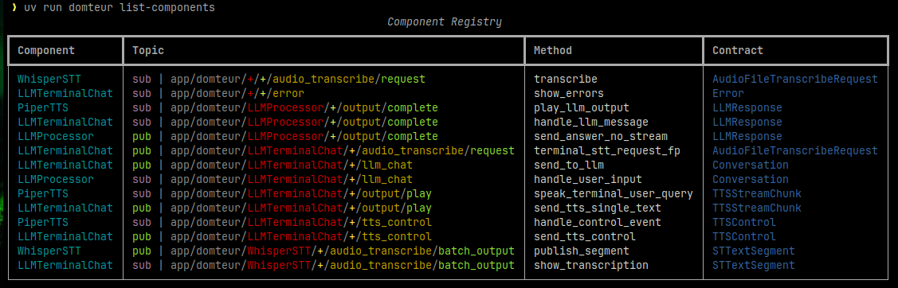

# domteur

Domteur is supposed to be an experimental assistant - of course - using AI that can be voice controlled or otherwise.
The design is an assembly of specialized clients that send and receive messages over the network via a message broker.

```
┌─────────────────┐    JSON Messages    ┌──────────────────┐
│ repl            │ ──────────────────> │ mqtt broker      │
│                 │                     │                  │
└─────────────────┘                     └──────────────────┘
                                                 │
                   ┌─────────────────────────────┼─────────────────────────────┐
                   │                             │                             │
                   v                             v                             v
        ┌─────────────────┐           ┌─────────────────┐           ┌─────────────────┐
        │ llm_processor   │           │ tts             │           │ persistence_    │
        │ (LangChain)     │           │                 │           │ manager         │
        └─────────────────┘           └─────────────────┘           └─────────────────┘
```
The main batteries include a framework to create those components and how to link them in code without losing the overview.



Using this design, you can use this library to use the abstractions and implement you own clients, 
and subclass existing clients to register new message handlers. The way you create a new client, let's say a 
terminal TUI application:

```python
from domteur.components.base import MQTTClient, on_receive, on_publish, MessagePayload
from pydantic import BaseModel
from aiomqtt import Message

class ControlCommand(MessagePayload):
    """Message Contract, define in other file to prevent circular imports when imported by other components"""
    play: str = "audio.way"


class TUIClient(MQTTClient):
    def __init__(
        self,
        client,
        settings: "Settings",
        name: str | None = None,
    ):
        super().__init__(client, settings, name)

    @on_publish(domain="output", contract=ControlCommand, event="play")
    async def request_play_sound(self, msg: Message | None, file, *args, **kwargs) -> ControlCommand:
        """A function that takes a mqtt message if triggered by another msg. If this function fails, an error 
        message is sent. Using additional (keyword-)arguments, you can use this function whenever sending this message contract"""
        return ControlCommand(play=file)

    
class AudioPlayer(MQTTClient):
    def __init__(
        self,
        client,
        settings: "Settings",
        name: str | None = None,
    ):
        super().__init__(client, settings, name)

    # Use component=TUIClient to filter the messages
    @on_receive(component="+", domain="output", contract=ControlCommand, event="play")
    async def play_a_sound(self, msg: Message | None, event: ControlCommand) -> None:
        """Receives messages from any components on topic domain output with event play"""
        print(f"playing file {event.play}")
```

## Installation

Install the command line tool using git repo:
    
    # Using pipx
    pipx install --user git+ssh://git@github.com/gh-PonyM/domteur.git#main
    pipx install git+https://github.com/gh-PonyM/domteur.git#main

    # User install on system
    pip install --user git+https://github.com/gh-PonyM/domteur.git#main

    domteur --version

## Starting components

Start the broker first:

    docker compose up broker

### LLM

     uv run domteur --cfg-file config.example.yml llm start

### Terminal

    uv run domteur --cfg-file config.example.yml chat repl


## Docker

Build the dev image:

     docker compose build llm

And run the component with the broker:

    docker compose up

## Features

- Todo